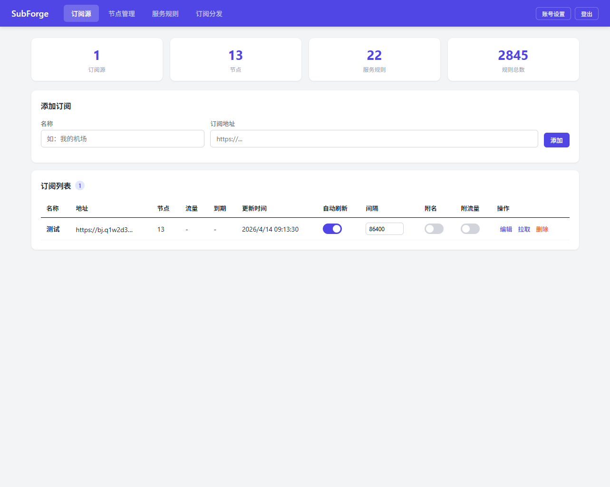
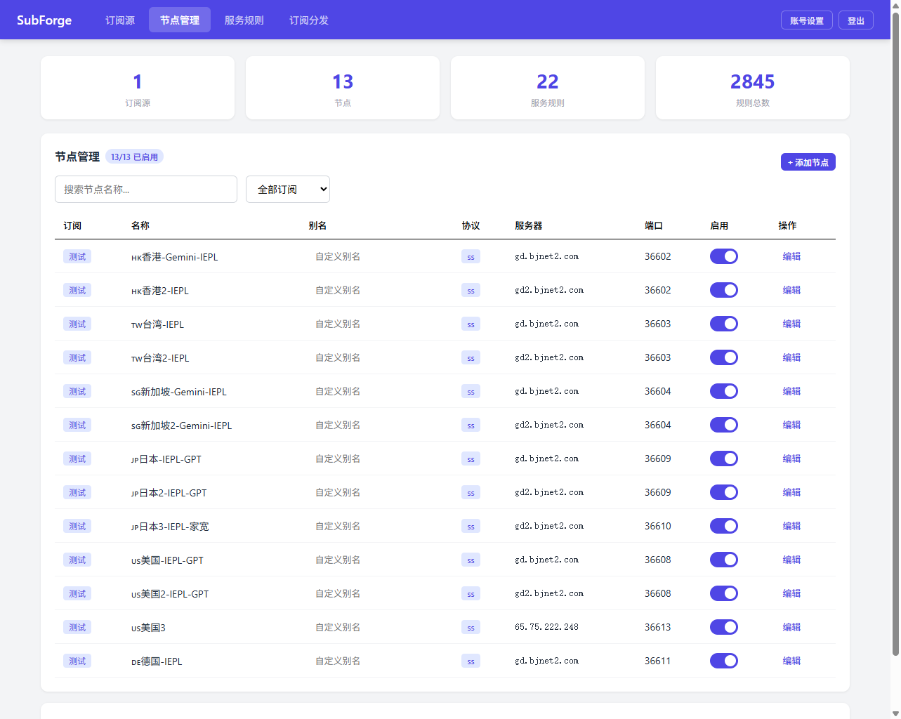
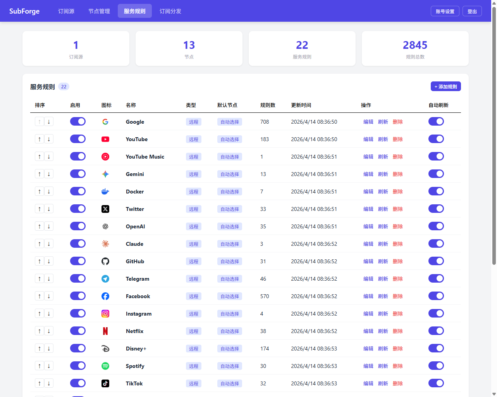
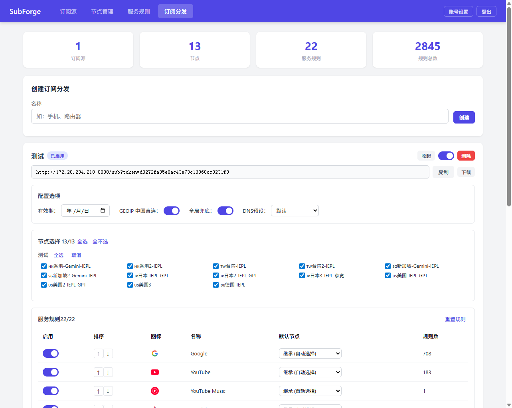

# SubForge

**SubForge** 是一个轻量级的 Clash 订阅管理与分发平台，使用 Go 构建，提供开箱即用的 Web 管理界面。

它可以将多个订阅源的节点聚合到一起，通过自定义的服务规则和 DNS 配置，为不同设备生成精简、可控的 Clash 配置文件。

## 功能特性

- **订阅源管理** — 添加多个订阅源，自动/手动拉取节点，支持流量统计和过期时间展示
- **节点管理** — 自定义别名、启用/禁用、预设别名规则、手动添加本地节点
- **服务规则** — 内置 22 条常用分流规则（Google、YouTube、OpenAI、Steam 等），支持添加远程/本地规则，可调整排序和启用状态
- **DNS 配置** — 内置 DNS 预设，支持自定义 DNS 配置并绑定到不同的分发配置
- **订阅分发** — 为不同设备创建独立的分发链接，支持：
  - 按需选择节点和服务规则
  - 每个配置独立设置 GEOIP 中国直连、全局兜底、DNS 预设
  - 服务规则代理覆盖（按配置修改默认代理节点）
  - 实时预览生成的 YAML 配置
- **Web 管理界面** — 单文件 Vue 3 前端，无需独立构建步骤
- **认证与安全** — Cookie 会话认证，bcrypt 密码哈希

## 截图

<!-- TODO: 替换为实际截图 -->

| 订阅源管理 | 节点管理 |
|:---:|:---:|
|  |  |

| 服务规则 | 订阅分发 |
|:---:|:---:|
|  |  |

> 截图目录位于 `docs/screenshots/`，请将实际截图文件放入该目录。

## 快速开始

### Docker 部署（推荐）

```bash
# 克隆仓库
git clone https://github.com/teacat99/SubForge.git
cd SubForge

# 启动服务
docker compose up -d
```

服务默认运行在 `http://localhost:8080`。

默认管理员账号：`admin` / `passwd`（首次登录后请立即修改）。

### Docker 自定义端口

编辑 `docker-compose.yaml` 中的端口映射：

```yaml
ports:
  - "9090:8080"   # 将 9090 改为你想要的端口
```

### 源码编译

要求：Go 1.24+

```bash
git clone https://github.com/teacat99/SubForge.git
cd SubForge

# 编译
go build -o subforge ./cmd/server/

# 运行
./subforge -port 8080
```

可选参数：

| 参数 | 默认值 | 说明 |
|------|--------|------|
| `-port` | `8080` | 监听端口 |
| `-db` | `data/subforge.db` | SQLite 数据库路径 |

## 项目结构

```
SubForge/
├── cmd/server/          # 程序入口
├── internal/
│   ├── api/             # HTTP API (Gin)
│   ├── generator/       # Clash 配置生成器
│   ├── model/           # 数据模型 (GORM)
│   ├── rule/            # 规则管理与内置规则
│   ├── store/           # 数据库操作层
│   └── subscription/    # 订阅解析 (YAML/Base64)
├── web/                 # 前端 (Vue 3 单文件)
├── Dockerfile
├── docker-compose.yaml
└── go.mod
```

## 致谢

SubForge 的开发依赖于以下优秀的开源项目和服务：

| 项目 | 用途 |
|------|------|
| [blackmatrix7/ios_rule_script](https://github.com/blackmatrix7/ios_rule_script) | 分流规则数据源 |
| [favicon.im](https://favicon.im) | 网站图标服务 |
| [Gin](https://github.com/gin-gonic/gin) | Go HTTP Web 框架 |
| [GORM](https://gorm.io) | Go ORM 框架 |
| [glebarez/sqlite](https://github.com/glebarez/sqlite) | 纯 Go SQLite 驱动 |
| [Vue 3](https://vuejs.org) | 前端框架 (CDN 加载) |

## 参与贡献

欢迎提交 Issue 和 Pull Request！请先阅读 [CONTRIBUTING.md](CONTRIBUTING.md) 了解贡献规范。

## 许可证

本项目基于 [Apache License 2.0](LICENSE) 开源。

Copyright 2026 teacat99
